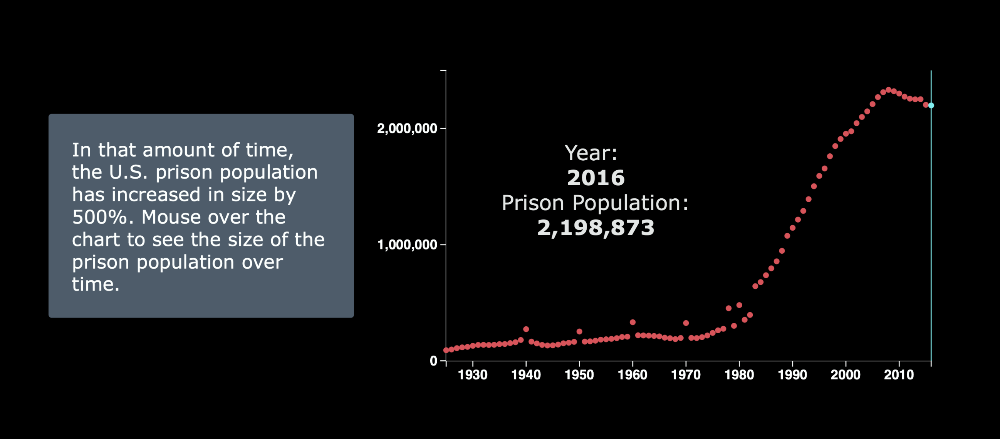

## We are including the team page in the readme, as allowed on Slack.

* Title: Prison in The U.S.
    Formerly: Marijuana Legalization
* Team Members: Elizabeth Weeks (eweeks), Benton Wilson (benton)
* Summary Image: 

* Abstract
  * Mass incarceration is a large, but often hidden issue in the United States. The number of prisoners in the U.S. has increased drastically in the last few decades, and it is an important issue to understand so that we can start to solve the problem as we try to overcome systemic racism. Using the D3 library as well as techniques learned during 6.859: Iteractive Data Visualization, we constructed a scrollytelly website in order to visualize the makeup of the U.S. prison popula- tion, relying mostly on a dynamically updating matrix of humanoid icons. At the end of the narrative walk through, users are invited to both explore the data further as well as visit websites of various organizations trying to take action against mass incarceration.

* Link to Paper:
  * Is in FinalPaper.pdf in this readme, and also availiable at: [https://6859-sp21.github.io/final-project-marijuana/final/FinalPaper.pdf](https://6859-sp21.github.io/final-project-marijuana/final/FinalPaper.pdf)
* Link to video:
  * [https://www.youtube.com/watch?v=cyY8JSKUUFo](https://www.youtube.com/watch?v=cyY8JSKUUFo)
* Running instructions
  * Our project result is a website. To get there go to [https://6859-sp21.github.io/final-project-marijuana/src/index.html](https://6859-sp21.github.io/final-project-marijuana/src/index.html)

* Breakdown of work
  * Overall we think that the work was split very evenly. Most of our work was done through pair programming or spliting up the work while coding in the same room.
  * We did most of our work during large chunks of time where we would create a list of tasks and then try to get through as many as possible before being done for the day.
* Commentary on project progress
  * The overall flow of our project development was: first get, process and explore the data, then work on making the icon visual render, then work on building a website aruond the visual, and finally iterate to improve.
  * Compared to A4, we placed much more emphasis on keeping our codebase modular and clean. Much of our code structure is based around callbacks, which are passed to handlers that use the callback to change the rendering of the grid of icons. This meant that in order to add a new filter, we just had to write a few small callback functions, which made the development process much faster.
  * Even though we still ran into issues with D3, we both feel significantly more comfortable with the data join as well as D3 selections.
